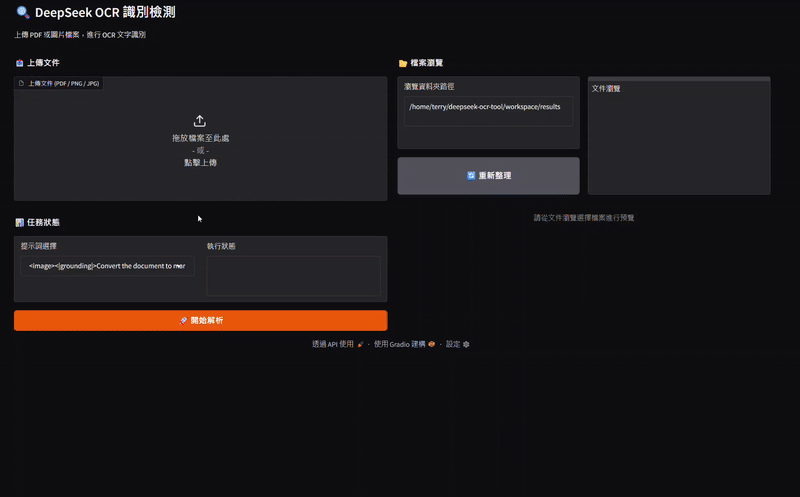
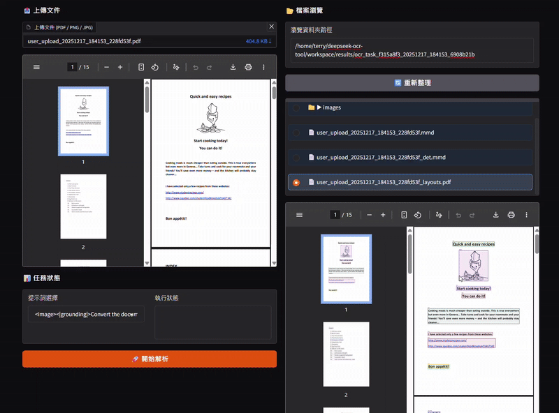
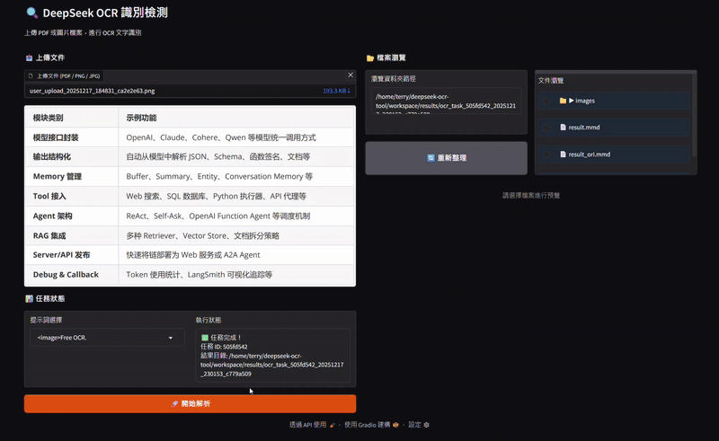
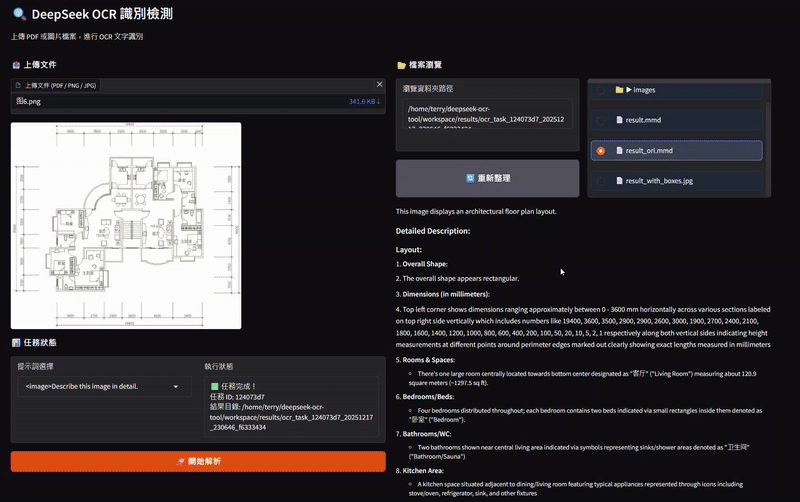
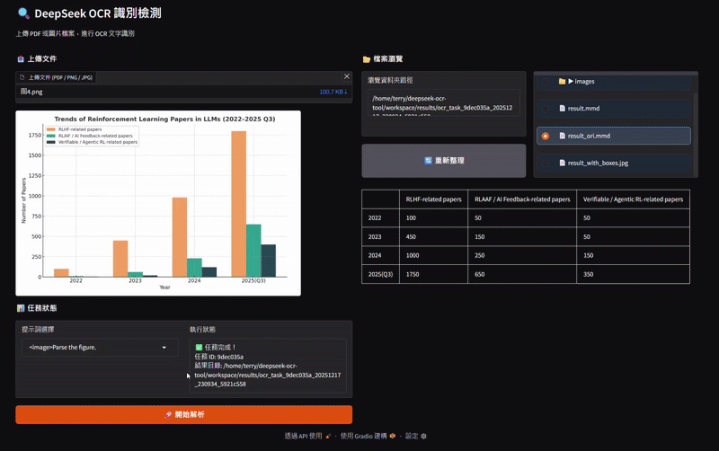

# 專案說明

本專案是 DeepSeek-OCR 的多模態文檔解析工具，具備高效的文字提取能力，還能理解文檔結構，支持表格解析、圖表分析以及多欄佈局還原，適用於多種文檔處理場景。

---

<div align="center">

**PDF文件解析 - 支援圖片、表格等複雜內容**


</div>
<div align="center">

| 多語種文字解析 | 圖表&表格解析 |
|:---:|:---:|
|  |  |

</div>

<div align="center">

| 專業領域圖面語意辨識（支援CAD、流程圖、裝飾圖等） | 資料分析視覺化圖反向解析 |
|:---:|:---:|
|  |  |

</div>

## 功能特性

- **多格式支持**: 支援 PDF、PNG、JPG 等多種文件格式。
- **高效處理**: 使用平行處理技術，支持大規模批量處理。
- **智慧 OCR 辨識**：基於 DeepSeek-OCR 模型，提供高精確度的文字識別
- **版面分析**：智慧識別文件版面結構，準確擷取內容版面
- **多語種支援**：支援中文、英文等多種語言的文字識別
- **表格&圖表解析**：專業的表格識別和圖表資料擷取功能
- **專業領域圖面識別**：支援各類專業領域圖面的語意識別
- **資料視覺化**：支援資料分析視覺化圖的逆向解析
- **Markdown 轉換**：將 PDF 內容轉換為結構化的 Markdown 格式
- **前後端分離架構**: 後端基於 FastAPI，前端基於 Gradio，支持快速部署和使用。

## 目錄結構

```
DeepSeek-OCR/
├── backend/                # 後端核心程式碼
│   ├── config_loader.py    # 配置加載模組
│   ├── inference_runner.py # OCR 任務執行器
│   ├── process/            # 圖像處理與預處理模組
│   ├── deepencoder/        # 深度學習模型相關程式碼
│   ├── main.py             # FastAPI 入口
│   └── ...                 # 其他模組
├── frontend/               # 前端 Gradio 介面
│   ├── gradio_app.py       # Gradio 主程式
│   └── ...                 # 其他資源
├── workspace/              # 工作區目錄
│   ├── uploads/            # 上傳的檔案
│   ├── results/            # 識別結果
│   └── logs/               # 日誌檔案
├── .env.example            # 配置範例文件
├── requirements.txt        # 相依套件列表
└── README.md               # 專案說明文件
```

---
### 系統需求

⚠️ **重要提示**：
- **作業系統**：需要在 Linux 系統下運行
- **顯示卡需求**：GPU ≥ 7 GB 記憶體（大圖/多頁 PDF 建議 16–24 GB）
- **相容性說明**：50 系顯示卡目前不相容，請使用其他型號顯示卡
- **Python 版本**：3.10–3.12（建議 3.10/3.11）
- **CUDA 版本**：11.8 或 12.1/12.2（需與顯示卡驅動程式相符）
- **PyTorch**：需安裝與 CUDA 相符的預編譯版本

## 快速開始
### 1. 下載 vllm-0.8.5 [whl](https://github.com/vllm-project/vllm/releases/tag/v0.8.5) 並放置 packages 資料夾底下

### 2. 環境配置

執行以下命令完成環境配置：
   ```bash
   bash install.sh
   ```

### 3. 啟動後端服務

執行以下命令啟動 FastAPI 後端：
```bash
python backend/main.py
```

### 4. 啟動前端介面

執行以下命令啟動 Gradio 前端：
```bash
python frontend/gradio_app.py
```

### 5. 使用

- 打開瀏覽器，連線到 http://localhost:7861。
- 上傳 PDF 或圖片文件，選擇提示詞，點擊「開始解析」。

---

## API 功能

DeepSeek-OCR 提供以下 API：

- **文件上傳**: `/api/upload`
- **啟動 OCR 任務**: `/api/start`
- **查詢任務進度**: `/api/progress/{task_id}`
- **獲取結果文件**: `/api/result/{task_id}`
- **預覽文件內容**: `/api/file/content`

---
